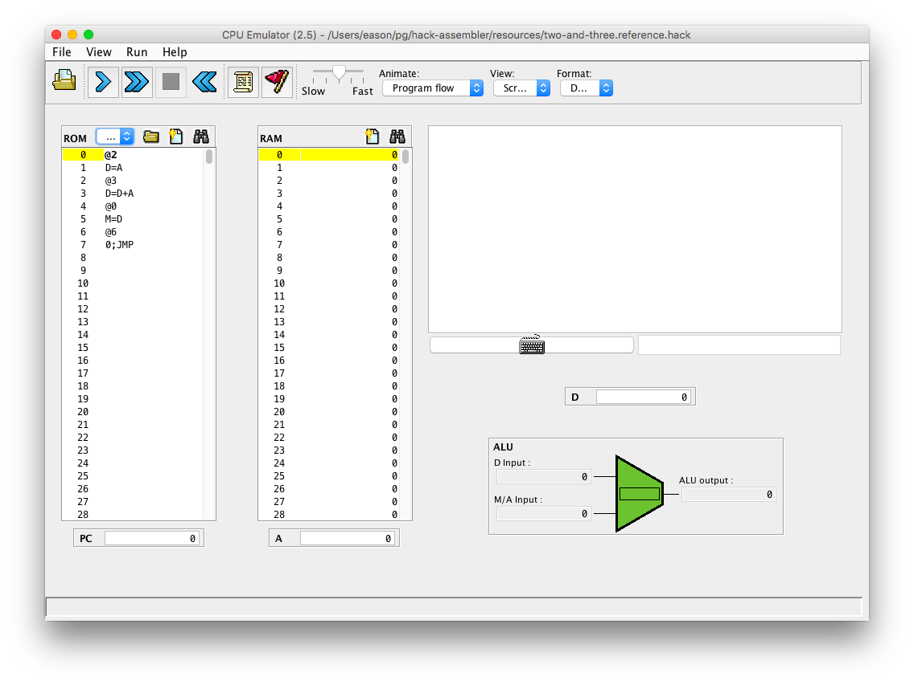

hack-assembler
==============

# An assembler for an educational assembly language

`hack-assembler` is a command-line tool that compiles assembly programs written
in an language called "Hack", into a plain-text form of binary machine code
that targets the "Hack" instruction set architecture.

Both the Hack language and the Hack hardware platform are developed as part of
the course [nand2tetris][homepage]. Indeed, `hack-assembler` is an 
implementation of project 06 of the course: [Project 6: The Assembler][project]. 
Specifications for the Hack language can be found in a chapter of the textbook 
for that course: [(PDF) 6.  Assembler][chapter].

# Installation

    $ brew install easoncxz/tap/hack-assembler
    ... Homebrew does its thing ...
    $ which hack-assembler
    /usr/local/bin/hack-assembler

For macOS, I've set up some CI servers to pre-compile the package for you if you 
are on High Sierra (macOS 10.13) through to Catalina (macOS 10.15), so the `brew 
install` should be pretty quick (less than a minute). If you're on another OS 
platform, the above installation would still work, but Homebrew will need to use 
your machine to compile my Haskell code and all its dependencies. 
`hack-assembler` will take some 15-60 minutes to build depending on your 
machine's performance.

# Usage example

Here's a minimal example:

    $ which hack-assembler
    /usr/local/bin/hack-assembler
    $ echo 'D = D - 1' | hack-assembler
    1110001110010000

`hack-assembler` reads Hack assembly code from standard input, and writes 
plain-text binary machine code to standard output.  Here's a more realistic 
example:

In a file, say `two-and-three.asm`:

    // This file is part of www.nand2tetris.org
    // and the book "The Elements of Computing Systems"
    // by Nisan and Schocken, MIT Press.
    // File name: projects/06/add/Add.asm

    // Computes R0 = 2 + 3  (R0 refers to RAM[0])

        @2
        D=A
        @3
        D=D+A
        @0
        M=D
    (INFINITE_LOOP)
        @INFINITE_LOOP
        0;JMP

If we run the command:

    hack-assembler < two-and-three.asm > two-and-three.hack

We will get a file `two-and-three.hack` with the contents below:

    0000000000000010
    1110110000010000
    0000000000000011
    1110000010010000
    0000000000000000
    1110001100001000

I have provided the above `two-and-three.asm` and a reference output
`two-and-three.reference.hack` inside the `resources` directory for your
convenience.

# Hack language and platform

The Hack language has only a handful of types of instructions:

- "A instructions", with their leading `@`, and
- "C instructions", with three sometimes-optional components separated by `=`
  and `;` symbols, and
- Some pseudo-instructions like comments (`//`) and labels (`(LABEL)`).

I implemented these in the `Model` module.  To know more about the syntax and
semantics of the Hack language, you'd have to read the chapter in the book :
[(PDF) 6.  Assembler][chapter].

To execute the resulting Hack binary machine code, you'll have to use the "CPU
Emulator" GUI program, which is implemented in Java Swing and provided by the
NAND to Tetris course staff: See [The Nand to Tetris Software Suite][software].
I've checked-in a copy of their software suite here at
[resources/nand2tetris.zip][zip].

The GUI can be launched via the script at `nand2tetris/tools/CPUEmulator.sh`
inside the zip file. It looks like this if we load up the example
`resources/two-and-three.reference.hack` program from above:

Click the "Load Program" icon (brown folder), select your plain-text binary
`.hack` file, then click the "Run" icon (`>>` symbol) to start running your
Hack program.

# Development

Compile and run `hack-assembler` from source:

    $ git clone git@github.com:easoncxz/hack-assembler.git
    $ cd hack-assembler
    
Install [Stack][hs-stack], most conveniently via their curl-method:

    curl -sSL https://get.haskellstack.org/ | sh

Then you're ready to compile some code.

    $ stack build
    ... it then takes ages to compile half the Haskell ecosystem ...

    $ stack test
    ... (my tests passing) ...

    $ stack exec -- hack-assembler < hello.asm > output.hack

    $

# About packaging and publishing

As you'd probably have figured from the above, I've published `hack-assembler` 
as a Homebrew Formula, [`hack-assembler.rb`][formula], over in my personal 
Homebrew Tap at [`easoncxz/homebrew-tap`][tap]. "Formula" and "Tap" are 
[Homebrew's beer-themed jargon words][beer]. Homebrew identifies my tap by their 
naming convention as `easoncxz/tap`, hence the Homebrew command `brew install 
easoncxz/tap/hack-assembler`.

To know more about how I've set it all up, you can read through my `.travis.yml` 
and `.github/workflows/` continuous-integration configuration files. It's a bit 
of a mess because I had to use Travis CI's macOS build servers to get macOS 
versions 10.13 and 10.14, and Github Action's build servers to get macOS 10.15.  

To decouple this repo from the nitty-gritty Homebrew-related details, I dealt 
with the Homebrew publishing workflows in a RubyGem I created for exactly this 
purpose, called [`homebrew_automation`][gem]. I use the `homebrew_automation.rb` 
CLI tool in this repo via `gem install homebrew_automation`.

[homepage]: http://www.nand2tetris.org/
[project]: https://www.nand2tetris.org/project06
[chapter]: resources/chapter-06.pdf
[software]: https://www.nand2tetris.org/software
[zip]: resources/nand2tetris.zip
[hs-stack]: https://docs.haskellstack.org/en/stable/README/
[tap]: https://github.com/easoncxz/homebrew-tap
[formula]: https://github.com/easoncxz/homebrew-tap/blob/master/Formula/hack-assembler.rb
[beer]: https://docs.brew.sh/
[gem]: https://github.com/easoncxz/homebrew-automation
